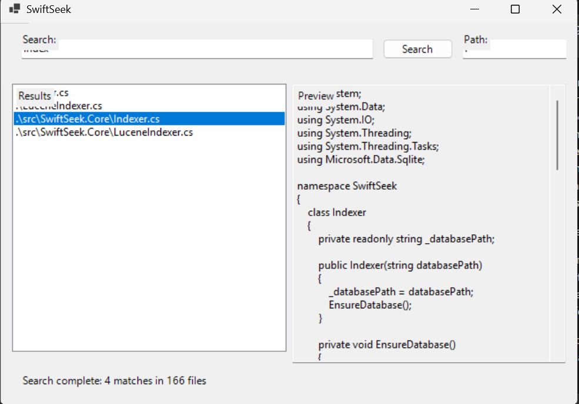

# SwiftSeek

[](https://github.com/RoPeak/swift-seek/actions/workflows/ci.yml)

SwiftSeek is a lightweight Windows search tool with a shared core library and a WinUI 3 desktop app. The core library handles metadata indexing, content indexing, and scanning; the UI is a thin shell that streams results and supports cancellation.

## Preview



## Repository Layout

- `src/SwiftSeek.Core` - core search library (SQLite metadata and Lucene.NET content indexing).
- `src/SwiftSeek.App` - WinUI 3 desktop app (unpackaged).
- `tests/SwiftSeek.Tests` - xUnit tests for the core.

## Build & Run

### Prerequisites

- Windows 10 or 11
- .NET 8 SDK
- Windows App Runtime (for WinUI 3)

Sanity check for the Windows App Runtime:

```powershell
Get-AppxPackage -AllUsers Microsoft.WindowsAppRuntime*
```

### Restore and build

```powershell
dotnet restore
dotnet build
```

### Run the desktop app (unpackaged)

The app is unpackaged (`WindowsPackageType=None`), so it uses the system Windows App Runtime:

```powershell
dotnet run --project src/SwiftSeek.App
```

## Features

- Recursive directory search
- SQLite-backed metadata catalogue
- Lucene.NET full-text indexing for content
- Scan fallback when no content index is present
- Streaming results, preview panel, and cancellation

## Design Notes

SwiftSeek balances speed, safety, and ease of use:

- **Fast metadata queries**: SQLite provides a persistent, queryable catalogue of file system metadata.
- **Scalable content search**: Lucene.NET handles large text collections efficiently with familiar search primitives.
- **Reliable fallback**: Scan mode keeps searches working when an index is missing or stale.
- **Privacy by default**: Indices are local and ignored by Git, avoiding accidental disclosure of personal data.

## Repository Hygiene

- The `swiftseek.db` file is generated at runtime and ignored in Git.
- Lucene content indices are stored under `.swiftseek/content-index` by default.
- Build artefacts (`bin/`, `obj/`, `.build/`) are ignored.
